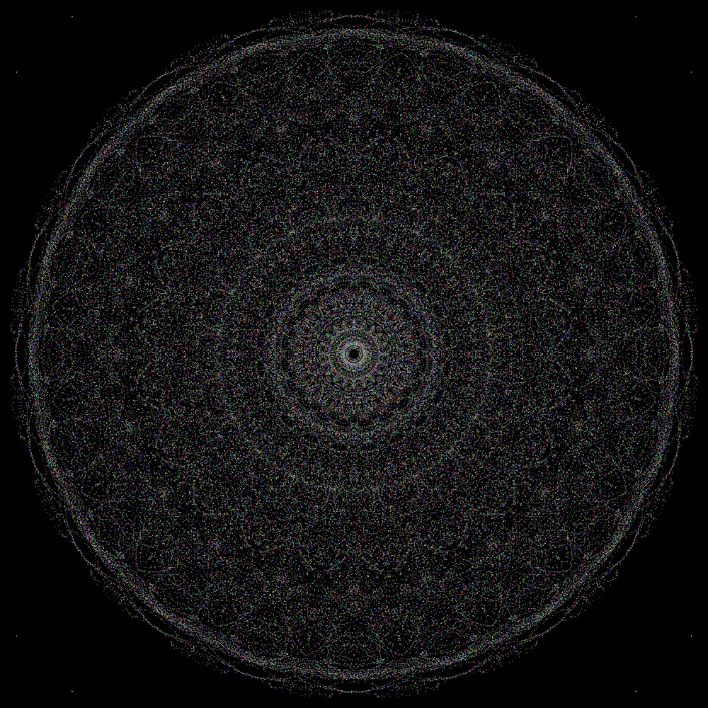
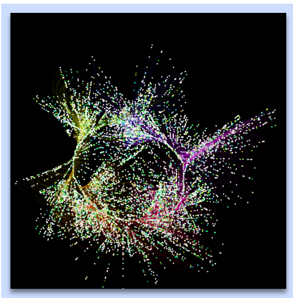

References:
P5 JS Examples and References: https://p5js.org/
Prof. Kate's A3 Examples

Pro Tip from a Mandala Artist :) : Set the symmetry level to maximum (slide it) and then press the mosaic button. You'll make beautiful work. 

The Mandala Art and Magical Rainbow also lets you save and download it as a jpg file. Have fun!

