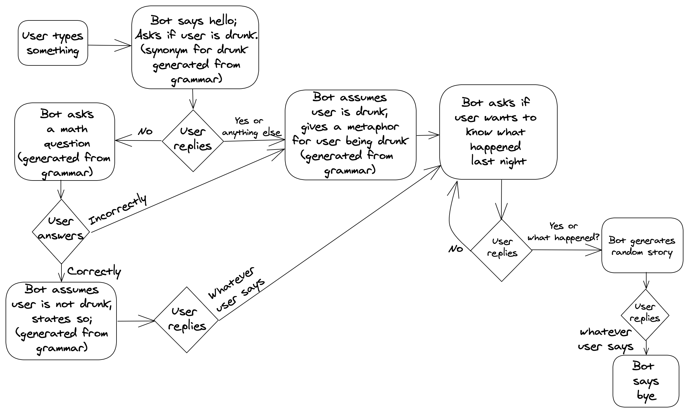

# Assignment 5 - Basic chat bot

The bot I built is called the drunken RoBot or just Ro-Bot. It represents the character of a sober friend who was looking on while you got drunk the previous night. The bot first figures out if you are drunk or not and then tells you the story of what happened last night (irrespective of whether you are drunk or sober).

## How to chat with it
<ol>
<li>You type in anything like Hello, Hey, Hi or literally anything</li>
<li>Bot responds by introducing itself and asking if you are drunk (synonym for drunk generated from grammar)</li>
<li>You can reply saying yes or no or something else. If you say yes, then skip to point 5</li>
<li>If you say no, the bot asks you the answer to a math problem(generated from the grammar). If you answer the problem correctly then it assumes you're sober and if you answer it wrong then it assumes you are drunk. It either mentions that you are drunk or that you aren't drunk. Synonyms for drunk generated from grammar.</li>
<li>Type something in response to what the bot just said</li>
<li>The bot asks if you want to hear the story of what happened last night. You can say yes or what happened to hear the story. If you say yes or what happened, it generates a story for you to read. The story has a basic template and the different pars are filled in using the grammar. If you say something else then it asks you again if you want to hear the story of what happened last night</li>
<li>You reply something in reaction to the story</li>
<li>Bot says bye with a snarky remark</li>
</ol>

## State diagram
I drew a state diagram to better understand the working of the bot

## References
- [Prof. Kate's code](https://github.com/galaxykate/CS396-GenMeth-21W/tree/main/classweb/students/katecompton/a5) was the main source through which I built my bot
- Huge list of sources to build my grammar - [Drunk synonyms](https://www.google.com/search?q=drunk+synonyms&oq=drunk+synonyms&aqs=chrome.0.69i59j0l6j69i60.2611j0j7&sourceid=chrome&ie=UTF-8), [Verb list](https://www.citationmachine.net/resources/grammar-guides/verb/list-verbs/), [Top movie quotes](https://blog.hubspot.com/sales/famous-movie-quotes), [List of everyday objects](https://www.vocabulary.com/lists/189583)
- [Google fonts, Alegreya](https://fonts.google.com/specimen/Alegreya)
- [CSS colour](https://www.99colors.net/name/cerulean-blue)